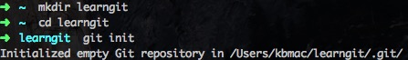
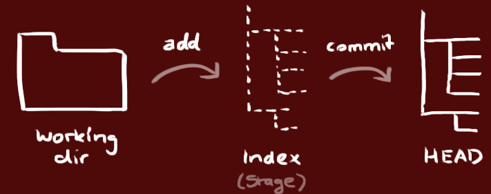
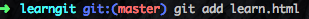
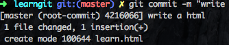
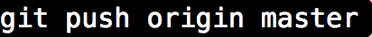
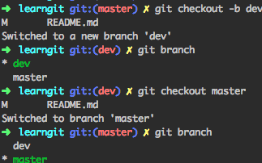

#GIT 分享

###Git是什么？

Git是目前世界上最先进的分布式版本控制系统。
我开始学习git的原因主要是因为它可以追踪我们的文件，可以实时查到文件的增删情况。

###SVN与Git的最主要区别

SVN是集中式版本控制系统，版本库是集中放在中央服务器的，而干活的时候，用的都是自己的电脑，所以首先要从中央服务器哪里得到最新的版本，然后干活，干完后，需要把自己做完的活推送到中央服务器。集中式版本控制系统是必须联网才能工作，如果在局域网还可以，带宽够大，速度够快，如果在互联网下，如果网速慢的话，就纳闷了。

　　Git是分布式版本控制系统，那么它就没有中央服务器的，每个人的电脑就是一个完整的版本库，这样，工作的时候就不需要联网了，因为版本都是在自己的电脑上。既然每个人的电脑都有一个完整的版本库，那多个人如何协作呢？比如说自己在电脑上改了文件A，其他人也在电脑上改了文件A，这时，你们两之间只需把各自的修改推送给对方，就可以互相看到对方的修改了。

###创建新的仓库
版本库英文名repository,可以把它理解为一个简单的目录，然后这里面文件的修改，删除都被git所追踪，省的还需要我们自己人力去追踪查询。 首先怎么创建一个版本库呢？我们先创建一个空目录随便起名，

之后通过$git init 命令把learngit目录变成可以被Git追踪管理的仓库 下面我们开始来把文件添加到版本库中，编写一个learn.html放到learngit目录中，一定要放到这个目录中！！因为只有这个目录是被git跟踪管理的。
###工作流
我们的本地仓库由git维护的三棵“树”组成。第一个是工作目录，它持有实际文件；第二个是缓存区（Index),它临时保存我们对文件的改动，最后是HEAD,指向最近一次提交后的结果。

###工作区和暂存区
Git和其他版本控制系统如SVN的一个不同之处就是有暂存区的概念。

工作区就是你在电脑里能看到的目录。

暂存区就是还没有push到远端的区域。

###添加提交、推送改动
这个步骤几乎是我每天都必做的事情，而且还做很多遍。第一步通过命令git add告诉Git,把文件放入仓库中：

当页面没有任何显示的时候，那么恭喜你说明添加成功。 接下来开始第二步，用命令git commit 告诉Git把文件提交到仓库。

$git commit -m "write a file" -m后面输入的是本次提交的说明介绍，可以方便我们找到改动记录。git commit执行后会告诉你，1个文件被改动，因为我们新添加了learn.html。
####推送改动：
这时改动已经在本地仓库的HEAD中了，执行以下命令可以提交到远端仓库

如果没有铺克隆现有仓库，但是想让仓库连接到某个服务器，可以使用下列命令添加

这样就可以将改动推送到所添加的服务器上了。

###git使用方法
要随时掌握工作区的状态，使用git status命令。

如果git status命令可以让我们随时掌握仓库的状态，当我们改动一个文件的时候，过了几天忘了更改了那个文件里面的东西，通过git status来查看，用git diff可以查看修改内容。

HEAD指向的版本就是当前版本，因此，Git允许我们在版本的历史之间穿梭，使用命令git reset --hard commit_id。

穿梭前，用git log可以查看提交历史，以便确定要回退到哪个版本。

要重返未来，用git reflog查看命令历史，以便确定要回到未来的哪个版本

###分支管理
在工作中经常用到的就是分支管理，首先来看分支到底有什么用呢？
假如我们正在完成一个项目，当我们写到一半的时候遇到一些其他的事情需要处理，如果现在提交代码的话，但是代码没有写完，会对别人的工作有影响，但是不提交怕代码丢失。
这个时候分支出现了，它来帮助我们解决这个问题。创建一个自己的分支，每次做完之后提交，也不用影响其他人的工作，当项目完成后在合并到原来的分支上。git的分支无论创建，切换，删除都能很快的完成。
首先我们来看怎样创建与合并分支：每次提交之后，git都会把它们串成一条时间线，这条时间线就是一个分支，这个分支就是主分支，即master分支。在git里用HEAD来表示当前的版本，它不是指向提交，而是指向master,master指向提交，HEAD指向的就是当前分支。下面我们开始来创建dev分支，然后切换到dev上

git checkout -b dev  --创建并切换分支
git branch           --查看当前的分支
git checkout 命令加上 –b参数表示创建并切换，相当于如下2条命令
git branch dev ,git checkout dev
git branch命令会列出所有分支，当前分支前面会标一个*号。当我们对一个apple.html文件进行修改，然后通过$git add apple.html,$git commit -m "branch test"完成dev分支的工作，通过$git checkout master来切回到主分支，在查看刚才更改的apple.html发现更改的内容没了，感觉很费劲吧，明明改动了却没有变化。因为刚才那个提交是在dev分支上，并没有在master主分支进行更改。想要让主分支的也改动应该怎么办呢，我们来合并分支，把dev上更改的文件来合并到master分支上。通过$git merge dev，git merge命令用于合并分支到当前所在的分支，这事我们更改的文件在master上就更改了。之后可以删除dev分支，通过$git branch -d dev。
我刚开始用的时候遇到的最大问题就是合并冲突，什么是合并冲突呢，我的理解就是当一个文件在分支上进行改动了，主分支上也进行改动了，都有各自新的提交。这时git无法执行“快速合并”，试图把分支和主分支上修改的合并起来，但是会产生合并冲突，必须我们手动来解决，git用<<<<<<<，=======，>>>>>>>标记不同分支的内容，我们修改后保存。之后在git add,git commit.
###替换本地改动
假如你做错事（自然，这是不可能的），你可以使用如下命令替换掉本地改动：
git checkout -- <filename>
此命令会使用 HEAD 中的最新内容替换掉你的工作目录中的文件。已添加到缓存区的改动，以及新文件，都不受影响。

假如你想要丢弃你所有的本地改动与提交，可以到服务器上获取最新的版本并将你本地主分支指向到它：
git fetch origin
git reset --hard origin/master
